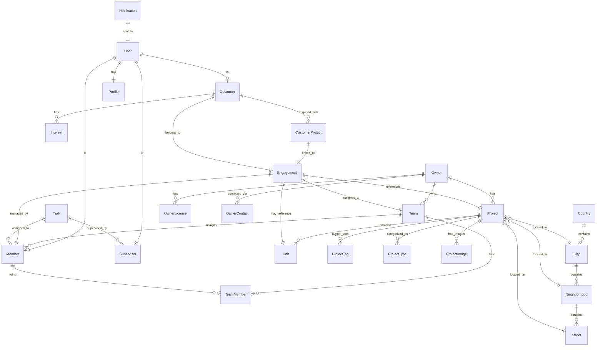
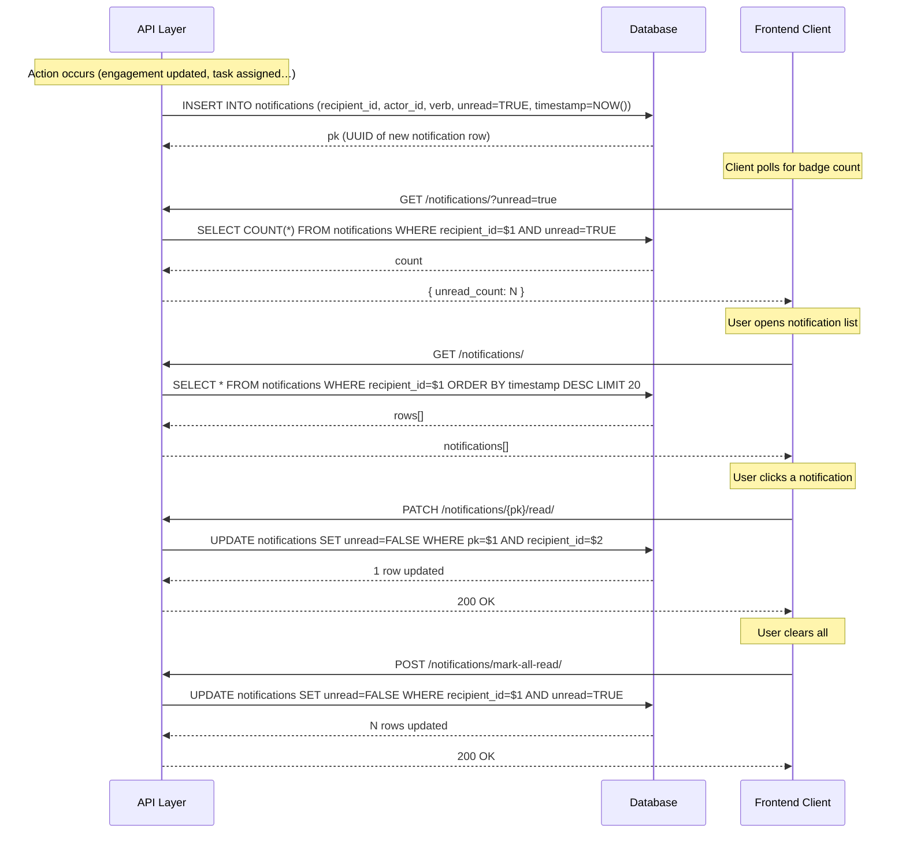

# CRM System — Database Schema & Architecture Analysis

> A complete reverse-engineered database schema and architecture analysis of a multi-tenant real estate CRM system, covering 25+ tables across 5 domains.

---
Type: post
Date: 2026-03-06
Reading time: 25 min read
---

# CRM System — Database Schema & Architecture Analysis

> Reverse-engineered from frontend TypeScript evidence (types, API slices, form components).
> Framework-agnostic SQL. Covers ~25 tables across 5 domains.

## Entity Relationship Diagram



---

## Key Architectural Insights

### 1. One-to-One Extension Pattern (Shared Base Table)

The `users` table is the base identity table. Four role-specific tables extend it via a 1:1 FK pointing at `users.id`:

- **members** → Sales agents who work for Owners
- **supervisors** → Managers who oversee Members and Tasks
- **customers** → End clients who engage with Projects
- **owners** → Real estate companies/individuals (separate entity, NOT in `users`)

Each role-specific table's `id` column is both its PK **and** a FK to `users(id)`. This is the **shared base table** pattern — one auth record, one profile, multiple role shapes. The `profiles` table similarly hangs off `users(id)` for extended attributes (birthdate, gender, timezone, image).

### 2. Multi-Tenant Hierarchy: Owner > Team > Member

The system implements a sophisticated multi-tenant pattern:

```
Owner (Real Estate Company)
  └── Team (Sales Team)
       └── TeamMember (Many-to-Many join)
            └── Member (Sales Agent)
```

This allows:
- Owners to manage multiple sales teams
- Members to belong to multiple teams
- Projects to be assigned to specific teams
- Fine-grained access control and reporting

### 3. Engagement: The Central CRM Pivot Table

The `Engagement` table is the heart of the CRM, connecting:
- **Customer** → Who is interested
- **Project** → What property they're interested in
- **Unit** → Specific unit (optional)
- **Team** → Which team is handling the lead
- **Member** → Which agent is assigned

Key engagement statuses drive the conversion funnel:
1. `contact` - Initial contact made
2. `not_respond` - Customer hasn't responded
3. `register_application` - Application submitted
4. `submit_project` - Project submitted to customer
5. `visit_request` - Site visit requested
6. `visit_confirmation` - Visit scheduled
7. `reservation` - Unit reserved (conversion!)

Each status transition tracks `status_converted_at` for analytics.

### 4. Location Hierarchy

A 4-level location hierarchy enables granular geographic filtering:
```
Country → City → Neighborhood → Street
```

Projects reference all three location levels (city, neighborhood, street) for flexible search and reporting.

### 5. Enum-as-VARCHAR Pattern (Lookup Endpoints)

Several project columns store short string codes rather than integer IDs or a separate enum type. The API exposes lookup endpoints (`/tanks/`, `/sukuk/`, `/ac/`) that return `[code, label]` pairs. The column stores only the code; the label is computed at the API layer.

```sql
-- Column in DB stores the code only
tanks_field VARCHAR(50)  -- e.g. 'private', 'shared', 'none'
```

```typescript
// API response adds a computed display field — NOT stored in DB
interface Project {
    tanks_field: string;          // 'private'
    tanks_field_display: string;  // 'Private Tank'  ← API-computed
}
```

**Affected columns in `projects`:**
| Column | Lookup endpoint | Example values |
|--------|----------------|----------------|
| `tanks_field` | `/tanks/` | private, shared, none |
| `sukuk_field` | `/sukuk/` | available, not_available |
| `air_condition_field` | `/ac/` | central, split, none |
| `project_status_field` | `/status/` | under_construction, ready |
| `guard_field` | text/choice | — |
| `down_payment_field` | text/choice | — |

**Key insight:** `_display` suffix fields are **never stored** in the database. They are derived at the serialization layer and exist only in the API response.

### 6. Commented-Out Fields Pattern

The frontend code (`project-form.tsx`) contains many commented-out fields that **still exist in the database**:

```typescript
// Temporarily hidden from UI, but columns exist in DB:
// start_area, end_area
// start_price, end_price
// elevator, garden, commission
// advertisement_purpose
```

This is a common pattern for:
- Feature flagging without schema changes
- A/B testing different UI configurations
- Gradual rollout of new features

**Important:** When working with this schema, assume these columns exist even if not visible in current UI.

### 7. Soft-Delete & Audit Patterns

Several tables carry `is_active`, `is_deleted`, `deleted_at`, `created_at`, `updated_at` columns:

**Soft delete** (`is_deleted = true` / `deleted_at IS NOT NULL`) keeps the row in the DB so:
- Historical FKs (e.g. an engagement referencing a deleted owner) stay intact
- Records are recoverable without a backup restore
- Audit logs remain queryable

**`is_active` flag** is a lighter "deactivated but recoverable" toggle, common on `owners`, `cities`, `project_tags`. A deactivated owner won't appear in dropdowns but their projects still have a valid `owner_id`.

**`created_at` / `updated_at`** are set by a DB trigger (`update_updated_at_column`) so the API layer can never forget to update them.

**`created_by` / `updated_by`** store the UUID of the acting user — the foundation for a full audit trail ("who changed this?").

### 8. Notification System Architecture

See [Notification System Deep-Dive](#notification-system-deep-dive) below.

---

## Complete SQL Schema

> **Read order matters.** Tables are ordered so every FK references a table already defined above.
> Domain order: Locations → Auth & Users → Real Estate → CRM Core → Support Systems.

---

## Domain: Locations

```sql
-- ============================================================================
-- CRM DATABASE SCHEMA
-- Reverse-engineered from TypeScript evidence (types, API slices, forms)
-- ============================================================================
```

See location tables in the [Locations section](#domain-locations-1) below (they appear first in the CREATE TABLE sequence because every other domain depends on them).

---

## Domain: Auth & Users

```sql
-- ============================================================================
-- TABLE: users (Shared base identity table)
-- ============================================================================
-- All role-specific tables (members, supervisors, customers) extend this
-- via a 1:1 FK on id — the shared base table pattern.

CREATE TABLE users (
    id UUID PRIMARY KEY DEFAULT gen_random_uuid(),
    username VARCHAR(150) UNIQUE NOT NULL,
    email VARCHAR(254),
    phone_number VARCHAR(20) NOT NULL,
    password VARCHAR(128) NOT NULL,
    is_active BOOLEAN DEFAULT TRUE,
    last_login TIMESTAMP WITH TIME ZONE,
    created_at TIMESTAMP WITH TIME ZONE DEFAULT CURRENT_TIMESTAMP,
    updated_at TIMESTAMP WITH TIME ZONE DEFAULT CURRENT_TIMESTAMP,
    enabled_at TIMESTAMP WITH TIME ZONE,
    created_by UUID,
    updated_by UUID
);

-- Indexes for user lookups
CREATE INDEX idx_users_username ON users(username);
CREATE INDEX idx_users_email ON users(email);
CREATE INDEX idx_users_phone_number ON users(phone_number);
CREATE INDEX idx_users_is_active ON users(is_active);

-- ============================================================================
-- TABLE: profiles (Extended user attributes)
-- ============================================================================
-- Shared profile data for Members, Supervisors, and Customers

CREATE TABLE profiles (
    user_id UUID PRIMARY KEY REFERENCES users(id) ON DELETE CASCADE,
    birthdate DATE,
    gender VARCHAR(10),
    timezone VARCHAR(50) DEFAULT 'UTC',
    image VARCHAR(500),
    gender_display VARCHAR(50)
);

-- ============================================================================
-- TABLE: owners (Real Estate Owners)
-- ============================================================================
-- Owners are companies/individuals who list real estate projects
-- They are NOT in the users table - they are separate entities

CREATE TABLE owners (
    id UUID PRIMARY KEY DEFAULT gen_random_uuid(),
    type VARCHAR(50) NOT NULL,
    name VARCHAR(255) NOT NULL,
    name_en VARCHAR(255),
    name_ar VARCHAR(255),
    email VARCHAR(254),
    phone_number VARCHAR(20) NOT NULL,
    image VARCHAR(500),
    description TEXT,
    sort_order INTEGER DEFAULT 0,
    is_active BOOLEAN DEFAULT TRUE,
    is_deleted BOOLEAN DEFAULT FALSE,
    deleted_at TIMESTAMP WITH TIME ZONE,
    enabled_at TIMESTAMP WITH TIME ZONE,
    created_at TIMESTAMP WITH TIME ZONE DEFAULT CURRENT_TIMESTAMP,
    updated_at TIMESTAMP WITH TIME ZONE DEFAULT CURRENT_TIMESTAMP,
    created_by UUID,
    updated_by UUID
);

CREATE INDEX idx_owners_is_active ON owners(is_active);
CREATE INDEX idx_owners_is_deleted ON owners(is_deleted);

-- ============================================================================
-- TABLE: owner_licenses
-- ============================================================================

CREATE TABLE owner_licenses (
    id UUID PRIMARY KEY DEFAULT gen_random_uuid(),
    owner_id UUID NOT NULL REFERENCES owners(id) ON DELETE CASCADE,
    name VARCHAR(255) NOT NULL,
    number INTEGER NOT NULL,
    name_display VARCHAR(255)
);

CREATE INDEX idx_owner_licenses_owner_id ON owner_licenses(owner_id);

-- ============================================================================
-- TABLE: owner_contacts
-- ============================================================================

CREATE TABLE owner_contacts (
    id UUID PRIMARY KEY DEFAULT gen_random_uuid(),
    owner_id UUID NOT NULL REFERENCES owners(id) ON DELETE CASCADE,
    phone_number VARCHAR(20) NOT NULL,
    type VARCHAR(50) NOT NULL,
    type_display VARCHAR(100) NOT NULL
);

CREATE INDEX idx_owner_contacts_owner_id ON owner_contacts(owner_id);

-- ============================================================================
-- TABLE: members (Sales Agents)
-- ============================================================================
-- Members are sales agents who work for Owners

CREATE TABLE members (
    id UUID PRIMARY KEY REFERENCES users(id) ON DELETE CASCADE,
    member_id VARCHAR(50) UNIQUE NOT NULL,  -- Human-readable ID
    owner_id UUID NOT NULL REFERENCES owners(id),
    login_allowed BOOLEAN DEFAULT TRUE,
    role_display VARCHAR(50) DEFAULT 'member'
);

CREATE INDEX idx_members_owner_id ON members(owner_id);
CREATE INDEX idx_members_member_id ON members(member_id);

-- ============================================================================
-- TABLE: supervisors
-- ============================================================================
-- Supervisors manage Members and Tasks

CREATE TABLE supervisors (
    id UUID PRIMARY KEY REFERENCES users(id) ON DELETE CASCADE,
    deleted_at TIMESTAMP WITH TIME ZONE,
    login_allowed BOOLEAN DEFAULT TRUE,
    role_display VARCHAR(50) DEFAULT 'supervisor'
);

-- ============================================================================
-- TABLE: customers
-- ============================================================================
-- Customers are end clients interested in properties

CREATE TABLE customers (
    id UUID PRIMARY KEY REFERENCES users(id) ON DELETE CASCADE,
    customer_id VARCHAR(50) UNIQUE NOT NULL,
    expected_budget DECIMAL(15, 2) DEFAULT 0,
    source VARCHAR(20) CHECK (source IN ('crm', 'mobile')),
    login_allowed BOOLEAN DEFAULT TRUE,
    role_display VARCHAR(50) DEFAULT 'customer'
);

CREATE INDEX idx_customers_customer_id ON customers(customer_id);
CREATE INDEX idx_customers_source ON customers(source);

-- ============================================================================
-- TABLE: teams
-- ============================================================================

CREATE TABLE teams (
    id UUID PRIMARY KEY DEFAULT gen_random_uuid(),
    owner_id UUID NOT NULL REFERENCES owners(id),
    name VARCHAR(255) NOT NULL,
    total_projects INTEGER DEFAULT 0,
    total_team_tasks INTEGER DEFAULT 0,
    created_at TIMESTAMP WITH TIME ZONE DEFAULT CURRENT_TIMESTAMP,
    updated_at TIMESTAMP WITH TIME ZONE DEFAULT CURRENT_TIMESTAMP,
    created_by UUID,
    updated_by UUID
);

CREATE INDEX idx_teams_owner_id ON teams(owner_id);
CREATE INDEX idx_teams_name ON teams(name);

-- ============================================================================
-- TABLE: team_members (Many-to-Many: Teams ↔ Members)
-- ============================================================================

CREATE TABLE team_members (
    id UUID PRIMARY KEY DEFAULT gen_random_uuid(),
    team_id UUID NOT NULL REFERENCES teams(id) ON DELETE CASCADE,
    member_id UUID NOT NULL REFERENCES members(id) ON DELETE CASCADE,
    created_at TIMESTAMP WITH TIME ZONE DEFAULT CURRENT_TIMESTAMP
);

CREATE UNIQUE INDEX idx_team_members_team_member ON team_members(team_id, member_id);
CREATE INDEX idx_team_members_member_id ON team_members(member_id);

-- ============================================================================
-- TABLE: countries
-- ============================================================================

CREATE TABLE countries (
    code VARCHAR(2) PRIMARY KEY,
    name VARCHAR(255) NOT NULL
);

-- ============================================================================
-- TABLE: cities
-- ============================================================================

CREATE TABLE cities (
    id UUID PRIMARY KEY DEFAULT gen_random_uuid(),
    country_code VARCHAR(2) NOT NULL REFERENCES countries(code),
    name VARCHAR(255) NOT NULL,
    name_en VARCHAR(255),
    name_ar VARCHAR(255),
    boundaries JSONB,
    sort_order INTEGER DEFAULT 0,
    is_active BOOLEAN DEFAULT TRUE,
    enabled_at TIMESTAMP WITH TIME ZONE,
    created_at TIMESTAMP WITH TIME ZONE DEFAULT CURRENT_TIMESTAMP,
    updated_at TIMESTAMP WITH TIME ZONE DEFAULT CURRENT_TIMESTAMP,
    created_by UUID,
    updated_by UUID
);

CREATE INDEX idx_cities_country_code ON cities(country_code);
CREATE INDEX idx_cities_is_active ON cities(is_active);

-- ============================================================================
-- TABLE: neighborhoods
-- ============================================================================

CREATE TABLE neighborhoods (
    id UUID PRIMARY KEY DEFAULT gen_random_uuid(),
    city_id UUID NOT NULL REFERENCES cities(id) ON DELETE CASCADE,
    country_code VARCHAR(2) NOT NULL,
    name VARCHAR(255) NOT NULL,
    name_en VARCHAR(255),
    name_ar VARCHAR(255),
    boundaries JSONB,
    sort_order INTEGER DEFAULT 0,
    is_active BOOLEAN DEFAULT TRUE,
    enabled_at TIMESTAMP WITH TIME ZONE,
    created_at TIMESTAMP WITH TIME ZONE DEFAULT CURRENT_TIMESTAMP,
    updated_at TIMESTAMP WITH TIME ZONE DEFAULT CURRENT_TIMESTAMP,
    created_by UUID,
    updated_by UUID
);

CREATE INDEX idx_neighborhoods_city_id ON neighborhoods(city_id);
CREATE INDEX idx_neighborhoods_country_code ON neighborhoods(country_code);
CREATE INDEX idx_neighborhoods_is_active ON neighborhoods(is_active);

-- ============================================================================
-- TABLE: streets
-- ============================================================================

CREATE TABLE streets (
    id UUID PRIMARY KEY DEFAULT gen_random_uuid(),
    neighborhood_id UUID NOT NULL REFERENCES neighborhoods(id) ON DELETE CASCADE,
    city_id UUID NOT NULL,
    country_code VARCHAR(2) NOT NULL,
    name VARCHAR(255) NOT NULL,
    name_en VARCHAR(255),
    name_ar VARCHAR(255),
    boundaries JSONB,
    sort_order INTEGER DEFAULT 0,
    is_active BOOLEAN DEFAULT TRUE,
    enabled_at TIMESTAMP WITH TIME ZONE,
    created_at TIMESTAMP WITH TIME ZONE DEFAULT CURRENT_TIMESTAMP,
    updated_at TIMESTAMP WITH TIME ZONE DEFAULT CURRENT_TIMESTAMP,
    created_by UUID,
    updated_by UUID
);

CREATE INDEX idx_streets_neighborhood_id ON streets(neighborhood_id);
CREATE INDEX idx_streets_city_id ON streets(city_id);
CREATE INDEX idx_streets_country_code ON streets(country_code);
CREATE INDEX idx_streets_is_active ON streets(is_active);

-- ============================================================================
-- TABLE: project_types
-- ============================================================================

CREATE TABLE project_types (
    id UUID PRIMARY KEY DEFAULT gen_random_uuid(),
    name VARCHAR(100) NOT NULL UNIQUE,
    icon VARCHAR(500),
    description TEXT
);

-- ============================================================================
-- TABLE: project_tags
-- ============================================================================

CREATE TABLE project_tags (
    id UUID PRIMARY KEY DEFAULT gen_random_uuid(),
    name VARCHAR(100) NOT NULL,
    name_en VARCHAR(255),
    name_ar VARCHAR(255),
    note TEXT,
    is_active BOOLEAN DEFAULT TRUE,
    enabled_at TIMESTAMP WITH TIME ZONE,
    created_at TIMESTAMP WITH TIME ZONE DEFAULT CURRENT_TIMESTAMP,
    updated_at TIMESTAMP WITH TIME ZONE DEFAULT CURRENT_TIMESTAMP,
    created_by UUID,
    updated_by UUID
);

CREATE INDEX idx_project_tags_is_active ON project_tags(is_active);

-- ============================================================================
-- TABLE: projects
-- ============================================================================

CREATE TABLE projects (
    id UUID PRIMARY KEY DEFAULT gen_random_uuid(),
    owner_id UUID NOT NULL REFERENCES owners(id),
    type_id UUID REFERENCES project_types(id),
    city_id UUID REFERENCES cities(id),
    neighborhood_id UUID REFERENCES neighborhoods(id),
    street_id UUID REFERENCES streets(id),

    -- Basic Info
    name VARCHAR(255) NOT NULL,
    name_en VARCHAR(255) NOT NULL,
    name_ar VARCHAR(255) NOT NULL,
    category VARCHAR(50),
    about TEXT,
    about_en TEXT,
    about_ar TEXT,

    -- Location
    latitude DECIMAL(10, 8),
    longitude DECIMAL(11, 8),
    location VARCHAR(500),
    address TEXT,

    -- Property Specs
    license_number VARCHAR(255),
    start_area DECIMAL(10, 2),
    end_area DECIMAL(10, 2),
    start_price DECIMAL(18, 2),
    end_price DECIMAL(18, 2),
    price_link VARCHAR(500),
    rooms INTEGER,
    toilets INTEGER,
    parking INTEGER,
    elevator INTEGER,
    garden INTEGER,

    -- Financials
    commission DECIMAL(5, 2),
    advertisement_purpose VARCHAR(100),
    advertisement_license_number VARCHAR(255),
    advertisement_issue_date DATE,
    advertisement_expire_date DATE,

    -- Special Fields (enums stored as strings)
    down_payment_field VARCHAR(50),
    tanks_field VARCHAR(50),
    project_status_field VARCHAR(50),
    air_condition_field VARCHAR(50),
    sukuk_field VARCHAR(50),
    guard_field VARCHAR(50),

    commitment VARCHAR(255),
    commitment_en VARCHAR(255),
    commitment_ar VARCHAR(255),

    -- Metadata
    sort_order INTEGER DEFAULT 0,
    is_active BOOLEAN DEFAULT TRUE,
    is_featured BOOLEAN DEFAULT FALSE,
    enabled_at TIMESTAMP WITH TIME ZONE,
    note TEXT,

    -- Counts (denormalized for performance)
    units_count INTEGER DEFAULT 0,
    units_available_count INTEGER DEFAULT 0,
    units_reserved_count INTEGER DEFAULT 0,
    units_sold_count INTEGER DEFAULT 0,

    created_at TIMESTAMP WITH TIME ZONE DEFAULT CURRENT_TIMESTAMP,
    updated_at TIMESTAMP WITH TIME ZONE DEFAULT CURRENT_TIMESTAMP
);

CREATE INDEX idx_projects_owner_id ON projects(owner_id);
CREATE INDEX idx_projects_city_id ON projects(city_id);
CREATE INDEX idx_projects_neighborhood_id ON projects(neighborhood_id);
CREATE INDEX idx_projects_is_active ON projects(is_active);
CREATE INDEX idx_projects_is_featured ON projects(is_featured);
CREATE INDEX idx_projects_category ON projects(category);

-- ============================================================================
-- TABLE: project_teams (Many-to-Many: Projects ↔ Teams)
-- ============================================================================

CREATE TABLE project_teams (
    project_id UUID NOT NULL REFERENCES projects(id) ON DELETE CASCADE,
    team_id UUID NOT NULL REFERENCES teams(id) ON DELETE CASCADE,
    PRIMARY KEY (project_id, team_id)
);

-- ============================================================================
-- TABLE: project_tags_junction (Many-to-Many: Projects ↔ Tags)
-- ============================================================================

CREATE TABLE project_tags_junction (
    project_id UUID NOT NULL REFERENCES projects(id) ON DELETE CASCADE,
    tag_id UUID NOT NULL REFERENCES project_tags(id) ON DELETE CASCADE,
    PRIMARY KEY (project_id, tag_id)
);

-- ============================================================================
-- TABLE: project_images
-- ============================================================================

CREATE TABLE project_images (
    id UUID PRIMARY KEY DEFAULT gen_random_uuid(),
    project_id UUID NOT NULL REFERENCES projects(id) ON DELETE CASCADE,
    image VARCHAR(500) NOT NULL,
    absolute_url VARCHAR(500),
    sort_order INTEGER DEFAULT 0
);

CREATE INDEX idx_project_images_project_id ON project_images(project_id);

-- ============================================================================
-- TABLE: units
-- ============================================================================

CREATE TABLE units (
    id UUID PRIMARY KEY DEFAULT gen_random_uuid(),
    project_id UUID NOT NULL REFERENCES projects(id) ON DELETE CASCADE,

    name VARCHAR(255) NOT NULL,
    name_en VARCHAR(255) NOT NULL,
    name_ar VARCHAR(255) NOT NULL,
    status VARCHAR(50) NOT NULL,

    floor VARCHAR(20),
    area DECIMAL(10, 2),
    price DECIMAL(18, 2),
    rooms INTEGER,
    toilets INTEGER,

    has_private_sitting_room BOOLEAN DEFAULT FALSE,
    has_basement_parking BOOLEAN DEFAULT FALSE,

    note TEXT,
    sort_order INTEGER DEFAULT 0,

    created_at TIMESTAMP WITH TIME ZONE DEFAULT CURRENT_TIMESTAMP,
    updated_at TIMESTAMP WITH TIME ZONE DEFAULT CURRENT_TIMESTAMP,
    created_by UUID,
    updated_by UUID
);

CREATE INDEX idx_units_project_id ON units(project_id);
CREATE INDEX idx_units_status ON units(status);

-- ============================================================================
-- TABLE: unit_tags (Many-to-Many: Units ↔ Tags)
-- ============================================================================

CREATE TABLE unit_tags (
    unit_id UUID NOT NULL REFERENCES units(id) ON DELETE CASCADE,
    tag_id UUID NOT NULL REFERENCES project_tags(id) ON DELETE CASCADE,
    PRIMARY KEY (unit_id, tag_id)
);

-- ============================================================================
-- TABLE: unit_images
-- ============================================================================

CREATE TABLE unit_images (
    id UUID PRIMARY KEY DEFAULT gen_random_uuid(),
    unit_id UUID NOT NULL REFERENCES units(id) ON DELETE CASCADE,
    image VARCHAR(500) NOT NULL,
    sort_order INTEGER DEFAULT 0
);

CREATE INDEX idx_unit_images_unit_id ON unit_images(unit_id);

-- ============================================================================
-- TABLE: interests
-- ============================================================================

CREATE TABLE interests (
    id UUID PRIMARY KEY DEFAULT gen_random_uuid(),
    name VARCHAR(255) NOT NULL,
    category_display VARCHAR(100)
);

-- ============================================================================
-- TABLE: customer_interests (Many-to-Many: Customers ↔ Interests)
-- ============================================================================

CREATE TABLE customer_interests (
    customer_id UUID NOT NULL REFERENCES customers(id) ON DELETE CASCADE,
    interest_id UUID NOT NULL REFERENCES interests(id) ON DELETE CASCADE,
    PRIMARY KEY (customer_id, interest_id)
);

-- ============================================================================
-- TABLE: engagements (Central CRM pivot table)
-- ============================================================================

CREATE TABLE engagements (
    id UUID PRIMARY KEY DEFAULT gen_random_uuid(),
    engagement_id VARCHAR(50) UNIQUE NOT NULL,

    customer_id UUID NOT NULL REFERENCES customers(id) ON DELETE CASCADE,
    project_id UUID NOT NULL REFERENCES projects(id) ON DELETE CASCADE,
    unit_id UUID REFERENCES units(id) ON DELETE SET NULL,
    team_id UUID REFERENCES teams(id) ON DELETE SET NULL,
    member_id UUID NOT NULL REFERENCES members(id),

    -- Status tracking
    status VARCHAR(50) NOT NULL CHECK (status IN (
        'contact',
        'not_respond',
        'register_application',
        'submit_project',
        'visit_request',
        'visit_confirmation',
        'reservation'
    )),
    visit_date DATE,

    -- Status conversion tracking
    status_converted_at TIMESTAMP WITH TIME ZONE,
    engagement_date DATE NOT NULL,

    note TEXT,

    created_at TIMESTAMP WITH TIME ZONE DEFAULT CURRENT_TIMESTAMP,
    updated_at TIMESTAMP WITH TIME ZONE DEFAULT CURRENT_TIMESTAMP,
    created_by UUID,
    updated_by UUID
);

CREATE INDEX idx_engagements_customer_id ON engagements(customer_id);
CREATE INDEX idx_engagements_project_id ON engagements(project_id);
CREATE INDEX idx_engagements_member_id ON engagements(member_id);
CREATE INDEX idx_engagements_team_id ON engagements(team_id);
CREATE INDEX idx_engagements_status ON engagements(status);
CREATE INDEX idx_engagements_status_converted_at ON engagements(status_converted_at);
CREATE INDEX idx_engagements_engagement_date ON engagements(engagement_date);

-- Composite index for common queries
CREATE INDEX idx_engagements_customer_status ON engagements(customer_id, status);
CREATE INDEX idx_engagements_member_status ON engagements(member_id, status);

-- ============================================================================
-- TABLE: customer_projects (Denormalized view for Customer API)
-- ============================================================================
-- This appears to be a denormalized table derived from engagements
-- for efficient API responses

CREATE TABLE customer_projects (
    id UUID PRIMARY KEY DEFAULT gen_random_uuid(),
    customer_id UUID REFERENCES customers(id) ON DELETE CASCADE,
    project_id UUID REFERENCES projects(id) ON DELETE CASCADE,
    engagement_id UUID NOT NULL REFERENCES engagements(id),
    team_id UUID REFERENCES teams(id),
    member_id UUID REFERENCES members(id),

    name VARCHAR(255),
    type VARCHAR(50),
    status VARCHAR(50),
    visit_date DATE,
    note TEXT,
    status_converted_at TIMESTAMP WITH TIME ZONE,

    created_at TIMESTAMP WITH TIME ZONE DEFAULT CURRENT_TIMESTAMP,
    updated_at TIMESTAMP WITH TIME ZONE DEFAULT CURRENT_TIMESTAMP,
    note_created_at TIMESTAMP WITH TIME ZONE,
    note_updated_at TIMESTAMP WITH TIME ZONE,
    created_by UUID,
    updated_by UUID
);

CREATE INDEX idx_customer_projects_customer_id ON customer_projects(customer_id);
CREATE INDEX idx_customer_projects_engagement_id ON customer_projects(engagement_id);

-- ============================================================================
-- TABLE: tasks
-- ============================================================================

CREATE TABLE tasks (
    id UUID PRIMARY KEY DEFAULT gen_random_uuid(),
    title VARCHAR(255) NOT NULL,
    description TEXT,
    status VARCHAR(50) NOT NULL CHECK (status IN (
        'not_started',
        'in_progress',
        'completed'
    )),
    due_date DATE NOT NULL,

    created_at TIMESTAMP WITH TIME ZONE DEFAULT CURRENT_TIMESTAMP,
    updated_at TIMESTAMP WITH TIME ZONE DEFAULT CURRENT_TIMESTAMP,
    created_by UUID,
    updated_by UUID
);

CREATE INDEX idx_tasks_status ON tasks(status);
CREATE INDEX idx_tasks_due_date ON tasks(due_date);

-- ============================================================================
-- TABLE: task_members (Many-to-Many: Tasks ↔ Members)
-- ============================================================================

CREATE TABLE task_members (
    task_id UUID NOT NULL REFERENCES tasks(id) ON DELETE CASCADE,
    member_id UUID NOT NULL REFERENCES members(id) ON DELETE CASCADE,
    PRIMARY KEY (task_id, member_id)
);

-- ============================================================================
-- TABLE: task_supervisors (Many-to-Many: Tasks ↔ Supervisors)
-- ============================================================================

CREATE TABLE task_supervisors (
    task_id UUID NOT NULL REFERENCES tasks(id) ON DELETE CASCADE,
    supervisor_id UUID NOT NULL REFERENCES supervisors(id) ON DELETE CASCADE,
    PRIMARY KEY (task_id, supervisor_id)
);

-- ============================================================================
-- NOTIFICATION SYSTEM
-- See Notification System Deep-Dive below
-- ============================================================================

-- ============================================================================
-- TABLE: notifications
-- ============================================================================

CREATE TABLE notifications (
    pk UUID PRIMARY KEY DEFAULT gen_random_uuid(),
    recipient_id UUID NOT NULL REFERENCES users(id) ON DELETE CASCADE,
    actor_id UUID REFERENCES users(id) ON DELETE SET NULL,  -- User who triggered the notification
    verb VARCHAR(100) NOT NULL,  -- Action description (e.g., "assigned", "commented")
    unread BOOLEAN DEFAULT TRUE,
    timestamp TIMESTAMP WITH TIME ZONE DEFAULT CURRENT_TIMESTAMP,

    -- Optional: Target object references (polymorphic)
    target_ct_id VARCHAR(100),  -- Content Type ID
    target_object_id UUID,

    -- Optional: Action object references (polymorphic)
    action_ct_id VARCHAR(100),
    action_object_id UUID,

    -- JSON payload for extra data
    data JSONB
);

CREATE INDEX idx_notifications_recipient_id ON notifications(recipient_id);
CREATE INDEX idx_notifications_unread ON notifications(recipient_id, unread);
CREATE INDEX idx_notifications_timestamp ON notifications(timestamp DESC);

-- ============================================================================
-- TABLE: notification_devices
-- ============================================================================

CREATE TABLE notification_devices (
    id UUID PRIMARY KEY DEFAULT gen_random_uuid(),
    user_id UUID NOT NULL REFERENCES users(id) ON DELETE CASCADE,
    token VARCHAR(500) NOT NULL UNIQUE,  -- FCM/APNs device token
    platform VARCHAR(20) CHECK (platform IN ('ios', 'android', 'web')),
    active BOOLEAN DEFAULT TRUE,
    created_at TIMESTAMP WITH TIME ZONE DEFAULT CURRENT_TIMESTAMP,
    last_used_at TIMESTAMP WITH TIME ZONE DEFAULT CURRENT_TIMESTAMP
);

CREATE INDEX idx_notification_devices_user_id ON notification_devices(user_id);
CREATE INDEX idx_notification_devices_token ON notification_devices(token);
CREATE INDEX idx_notification_devices_active ON notification_devices(user_id, active);

-- ============================================================================
-- TABLE: notification_preferences
-- ============================================================================

CREATE TABLE notification_preferences (
    user_id UUID PRIMARY KEY REFERENCES users(id) ON DELETE CASCADE,
    email_enabled BOOLEAN DEFAULT TRUE,
    push_enabled BOOLEAN DEFAULT TRUE,
    sms_enabled BOOLEAN DEFAULT FALSE,

    -- Granular preferences
    engagement_update_enabled BOOLEAN DEFAULT TRUE,
    task_assigned_enabled BOOLEAN DEFAULT TRUE,
    new_message_enabled BOOLEAN DEFAULT TRUE,
    system_alert_enabled BOOLEAN DEFAULT TRUE,

    updated_at TIMESTAMP WITH TIME ZONE DEFAULT CURRENT_TIMESTAMP
);

-- ============================================================================
-- FUNCTIONS AND TRIGGERS
-- ============================================================================

-- Function: Update updated_at timestamp
CREATE OR REPLACE FUNCTION update_updated_at_column()
RETURNS TRIGGER AS $$
BEGIN
    NEW.updated_at = CURRENT_TIMESTAMP;
    RETURN NEW;
END;
$$ LANGUAGE plpgsql;

-- Apply trigger to tables with updated_at
CREATE TRIGGER update_users_updated_at BEFORE UPDATE ON users
    FOR EACH ROW EXECUTE FUNCTION update_updated_at_column();

CREATE TRIGGER update_owners_updated_at BEFORE UPDATE ON owners
    FOR EACH ROW EXECUTE FUNCTION update_updated_at_column();

CREATE TRIGGER update_teams_updated_at BEFORE UPDATE ON teams
    FOR EACH ROW EXECUTE FUNCTION update_updated_at_column();

CREATE TRIGGER update_projects_updated_at BEFORE UPDATE ON projects
    FOR EACH ROW EXECUTE FUNCTION update_updated_at_column();

CREATE TRIGGER update_units_updated_at BEFORE UPDATE ON units
    FOR EACH ROW EXECUTE FUNCTION update_updated_at_column();

CREATE TRIGGER update_engagements_updated_at BEFORE UPDATE ON engagements
    FOR EACH ROW EXECUTE FUNCTION update_updated_at_column();

CREATE TRIGGER update_tasks_updated_at BEFORE UPDATE ON tasks
    FOR EACH ROW EXECUTE FUNCTION update_updated_at_column();

-- ============================================================================
-- VIEWS
-- ============================================================================

-- View: Conversion Funnel Stats
CREATE VIEW conversion_funnel_stats AS
SELECT
    status,
    COUNT(*) as count,
    LAG(COUNT(*)) OVER (ORDER BY
        CASE status
            WHEN 'contact' THEN 1
            WHEN 'not_respond' THEN 2
            WHEN 'register_application' THEN 3
            WHEN 'submit_project' THEN 4
            WHEN 'visit_request' THEN 5
            WHEN 'visit_confirmation' THEN 6
            WHEN 'reservation' THEN 7
        END
    ) as previous_count,
    CASE
        WHEN LAG(COUNT(*)) OVER (ORDER BY
            CASE status
                WHEN 'contact' THEN 1
                WHEN 'not_respond' THEN 2
                WHEN 'register_application' THEN 3
                WHEN 'submit_project' THEN 4
                WHEN 'visit_request' THEN 5
                WHEN 'visit_confirmation' THEN 6
                WHEN 'reservation' THEN 7
            END
        ) > 0
        THEN ROUND(
            (COUNT(*)::FLOAT /
            LAG(COUNT(*)) OVER (ORDER BY
                CASE status
                    WHEN 'contact' THEN 1
                    WHEN 'not_respond' THEN 2
                    WHEN 'register_application' THEN 3
                    WHEN 'submit_project' THEN 4
                    WHEN 'visit_request' THEN 5
                    WHEN 'visit_confirmation' THEN 6
                    WHEN 'reservation' THEN 7
                END
            ) - 1) * 100, 2
        )
        ELSE NULL
    END as conversion_rate_percent
FROM engagements
GROUP BY status
ORDER BY
    CASE status
        WHEN 'contact' THEN 1
        WHEN 'not_respond' THEN 2
        WHEN 'register_application' THEN 3
        WHEN 'submit_project' THEN 4
        WHEN 'visit_request' THEN 5
        WHEN 'visit_confirmation' THEN 6
        WHEN 'reservation' THEN 7
    END;

-- View: Member Engagement Stats
CREATE VIEW member_engagement_stats AS
SELECT
    m.id as member_id,
    m.name as member_name,
    COUNT(DISTINCT e.customer_id) as total_customers,
    COUNT(*) FILTER (WHERE e.status = 'reservation') as reservation_count,
    COUNT(*) FILTER (WHERE e.status = 'visit_confirmation') as visit_confirmation_count,
    COUNT(*) FILTER (WHERE e.status = 'visit_request') as visit_request_count,
    COUNT(*) FILTER (WHERE e.status = 'register_application') as register_application_count,
    COUNT(*) FILTER (WHERE e.status = 'submit_project') as submit_project_count,
    COUNT(*) FILTER (WHERE e.status = 'contact') as contact_count
FROM members m
LEFT JOIN engagements e ON e.member_id = m.id
GROUP BY m.id, m.name;

-- ============================================================================
-- END OF SCHEMA
-- ============================================================================
```

---

## Notification System: Database-Level Flow

The entire notification lifecycle maps to three SQL operations. Nothing framework-specific — just rows and columns.



### The Three Tables

#### 1. `notifications` — Core record

Every notification is one row. The `unread` boolean drives the badge counter.

| Column | Purpose |
|--------|---------|
| `pk` | UUID primary key |
| `recipient_id` | FK → users — who sees it |
| `actor_id` | FK → users — who caused it |
| `verb` | Human-readable action string: "assigned", "updated status" |
| `unread` | `TRUE` until the user reads it |
| `timestamp` | When it was inserted |
| `target_ct_id` + `target_object_id` | Polymorphic pointer to any row (engagement, task, project…) |
| `data JSONB` | Extra context payload (avoids a second SELECT on the client) |

#### 2. `notification_devices` — Push tokens

Stores device tokens per user so the API can push to phone/tablet/web.

```sql
-- Query before sending push: find all active tokens for a user
SELECT token FROM notification_devices
WHERE user_id = $1 AND active = TRUE;
```

#### 3. `notification_preferences` — Per-user opt-outs

Checked **before** inserting a notification:

```sql
-- Check: should we even notify this user?
SELECT push_enabled, engagement_update_enabled
FROM notification_preferences
WHERE user_id = $1;
```

If `push_enabled = FALSE`, skip the push delivery. The row in `notifications` may still be inserted for in-app display.

### Key Index

```sql
-- Most-hit query: "how many unread do I have?"
CREATE INDEX idx_notifications_unread ON notifications(recipient_id, unread);
-- Covers: WHERE recipient_id = $1 AND unread = TRUE  →  sub-millisecond index scan
```

### Performance Notes

- `data JSONB` embeds context (project name, engagement id) so the client renders without a second query
- Cleanup: `DELETE FROM notifications WHERE timestamp < NOW() - INTERVAL '90 days'`
- For very high traffic: add a denormalized `unread_count INTEGER` column to `users`, decremented/incremented by a DB trigger

---

## Index Strategy Summary

| Table | Key Indexes | Purpose |
|-------|-------------|---------|
| users | username, email, phone_number | Authentication lookups |
| members | owner_id, member_id | Multi-tenant filtering |
| engagements | customer_id, member_id, status, status_converted_at | CRM analytics |
| projects | owner_id, city_id, neighborhood_id, is_active | Property search |
| notifications | recipient_id, unread, timestamp | Notification feed |
| tasks | status, due_date | Task management |

---

## Foreign Key Relationship Map

```
users (1) ──────┬────→ (1) members
                │
                ├────→ (1) supervisors
                │
                └────→ (1) customers

members (N) ←──── (1) owners
teams (N) ←─────── (1) owners
team_members (N) ← (N) teams, members

projects (N) ←──── (1) owners
units (N) ←──────── (1) projects
engagements (N) ←─ (1) customers, projects, members, teams

notifications (N) ← (1) users (as recipient)
notifications (N) ←─ (1) users (as actor)

tasks (N) ←──────── (N) members, supervisors
```

---

## Quick Reference Card

| Table | Domain | Key Columns | Notable Relationships |
|-------|--------|-------------|----------------------|
| `users` | Auth | id, username, phone_number, is_active | Base for members, supervisors, customers |
| `profiles` | Auth | user_id, birthdate, gender, image | 1:1 → users |
| `members` | Auth | id→users, owner_id, member_id | N:1 → owners; M:M → teams |
| `supervisors` | Auth | id→users, deleted_at | M:M → tasks |
| `customers` | Auth | id→users, customer_id, expected_budget, source | M:M → interests; 1:N → engagements |
| `countries` | Locations | code (PK), name | Root of location tree |
| `cities` | Locations | id, country_code, name, boundaries | N:1 → countries |
| `neighborhoods` | Locations | id, city_id, country_code, name | N:1 → cities |
| `streets` | Locations | id, neighborhood_id, city_id, name | N:1 → neighborhoods |
| `owners` | Real Estate | id, name, type, is_active, is_deleted | 1:N → projects, teams, members |
| `owner_licenses` | Real Estate | id, owner_id, number | N:1 → owners |
| `owner_contacts` | Real Estate | id, owner_id, phone_number, type | N:1 → owners |
| `project_types` | Real Estate | id, name, icon | 1:N → projects |
| `project_tags` | Real Estate | id, name, is_active | M:M → projects, units (via junction) |
| `projects` | Real Estate | id, owner_id, city_id, name, status | FK chains to locations, owners, types, tags |
| `project_tags_junction` | Real Estate | project_id, tag_id | Junction: projects ↔ project_tags |
| `project_images` | Real Estate | id, project_id, image, sort_order | N:1 → projects |
| `project_teams` | Real Estate | project_id, team_id | Junction: projects ↔ teams |
| `units` | Real Estate | id, project_id, name, status, price, area | N:1 → projects; M:M → tags |
| `unit_tags` | Real Estate | unit_id, tag_id | Junction: units ↔ project_tags |
| `unit_images` | Real Estate | id, unit_id, image | N:1 → units |
| `teams` | CRM Core | id, owner_id, name | N:1 → owners; M:M → members |
| `team_members` | CRM Core | team_id, member_id | Junction: teams ↔ members |
| `interests` | CRM Core | id, name, category_display | M:M → customers |
| `customer_interests` | CRM Core | customer_id, interest_id | Junction: customers ↔ interests |
| `engagements` | CRM Core | id, customer_id, project_id, unit_id, team_id, member_id, status | Central CRM pivot table |
| `customer_projects` | CRM Core | id, customer_id, engagement_id | Denormalized view cache |
| `tasks` | Support | id, title, status, due_date | M:M → members, supervisors |
| `task_members` | Support | task_id, member_id | Junction: tasks ↔ members |
| `task_supervisors` | Support | task_id, supervisor_id | Junction: tasks ↔ supervisors |
| `notifications` | Support | pk, recipient_id, actor_id, verb, unread | N:1 → users (x2) |
| `notification_devices` | Support | id, user_id, token, platform, active | N:1 → users |
| `notification_preferences` | Support | user_id, push_enabled, email_enabled | 1:1 → users |

---

*Source: Reverse-engineered from TypeScript types, API slices, and form components — Wahadat CRM*